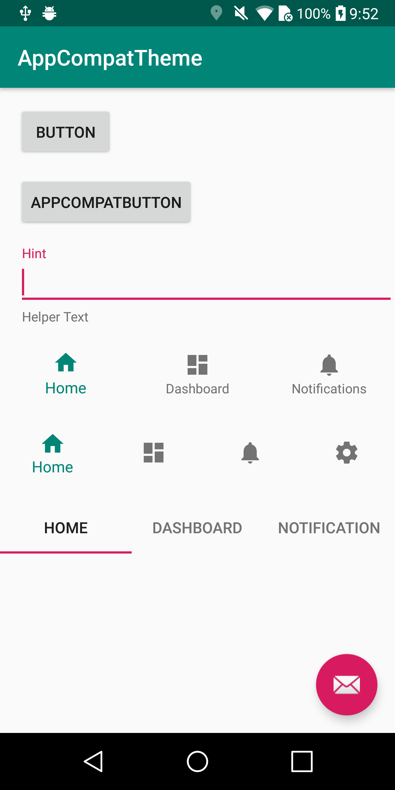
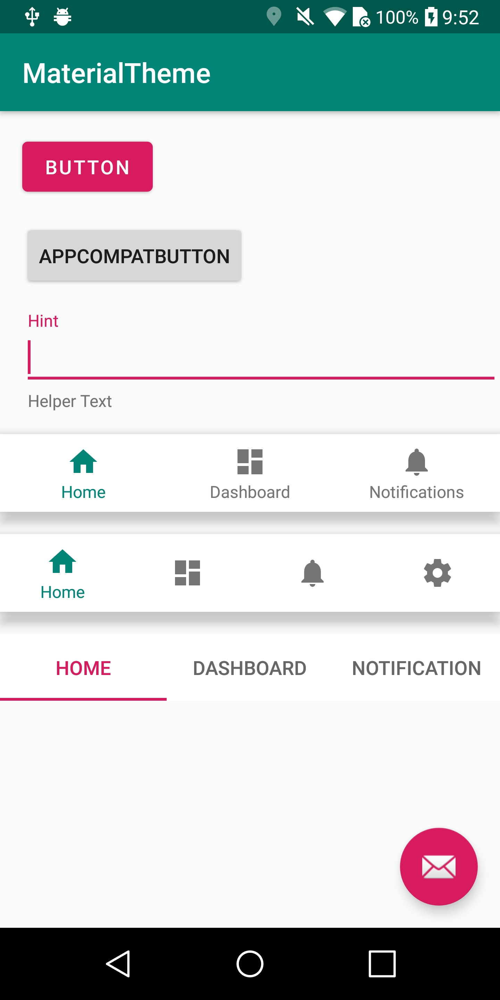
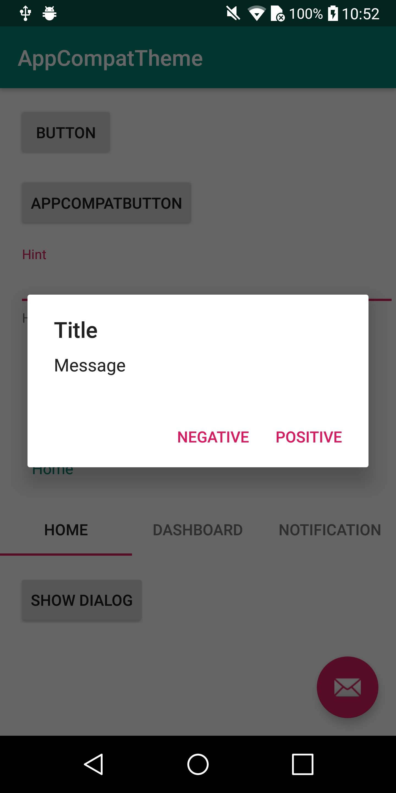
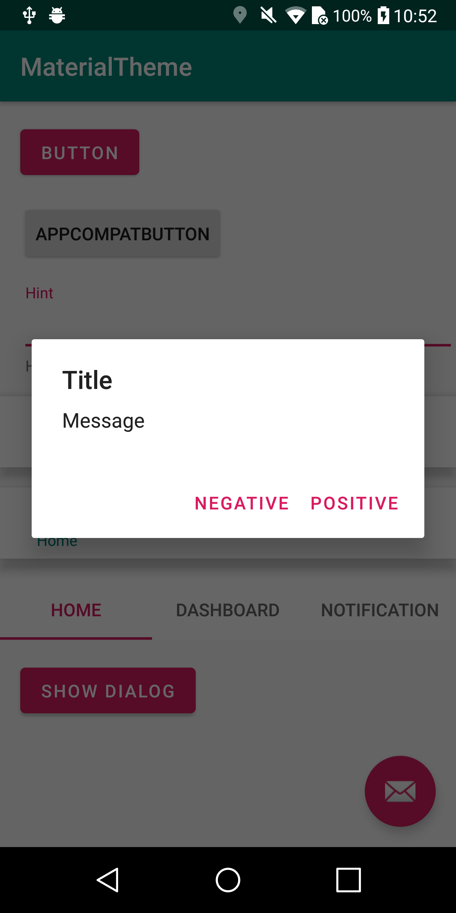
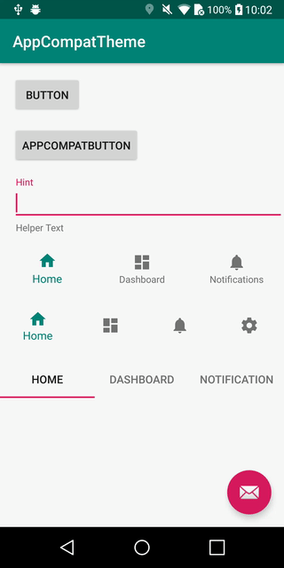
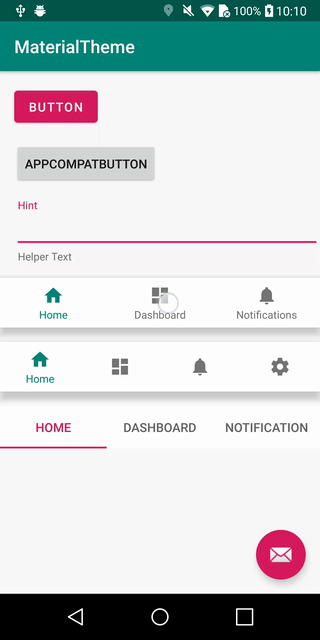
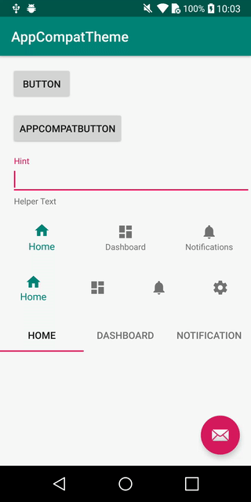
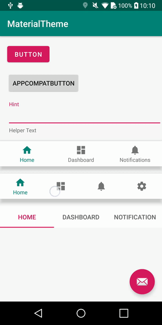
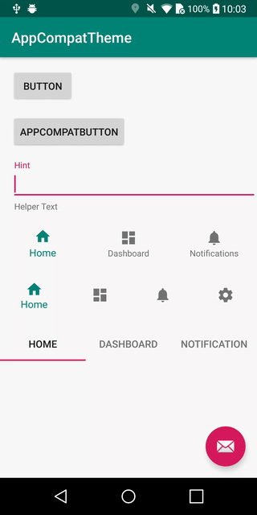
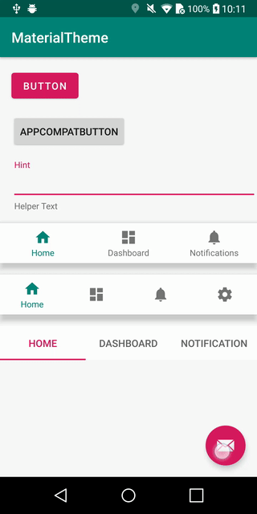

# DiffOfMaterialTheme-android  

This application for checking the difference between AppCompat and Material Components.

### Defining styles  
```
    <style name="AppCompatTheme" parent="Theme.AppCompat.Light.DarkActionBar">
        <item name="colorPrimary">@color/colorPrimary</item>
        <item name="colorPrimaryDark">@color/colorPrimaryDark</item>
        <item name="colorAccent">@color/colorAccent</item>
    </style>

    <style name="MaterialTheme" parent="Theme.MaterialComponents.Light.DarkActionBar">
        <item name="colorPrimary">@color/colorPrimary</item>
        <item name="colorPrimaryDark">@color/colorPrimaryDark</item>
        <item name="colorAccent">@color/colorAccent</item>
    </style>
```


### Diffs

* Top  

| AppCompat | Material |
| --- | --- |
|||


* Dialog  

| AppCompat | Material |
| --- | --- |
|||


* BottomNavigation  

| AppCompat | Material |
| --- | --- |
|||
|||


* FAB  

| AppCompat | Material |
| --- | --- |
|||
